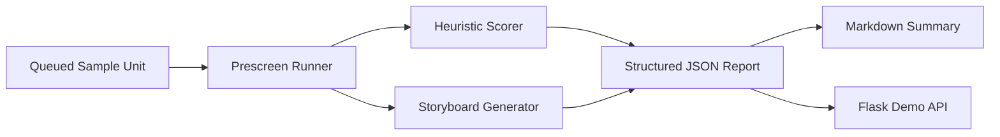

# autoSampler Public

[](https://github.com/Nightaw/autoSampler-public/actions/workflows/ci.yml)


这是我从本地采样与标签处理项目里整理出来的一份公开版 demo。  
这次没有直接把原始多服务目录整包公开，而是抽出了更适合个人项目展示的一条主线：

- 样本 unit 读取
- stall / resolution 标签初筛
- 关键帧 storyboard 证据生成
- 结构化 JSON / Markdown 报告
- Flask demo API 与 job lifecycle

公开版更像一个可以直接运行的小型服务，而不是一堆离散脚本。

## 我想展示的是什么

做音视频采样和标签治理时，真正有工程价值的并不只是“拿到产物”，而是后面的这条链路：

- 样本进入待处理队列
- 标签元数据和录屏被统一读取
- 初筛规则把明显异常样本先筛出来
- 关键帧证据帮助人工快速复核
- 最后输出结构化结果，方便复盘和接系统

这份仓库就围绕这条链路做了一个可公开、可运行的 mock 版本。

## 这次公开版里有什么

### 1. Prescreen Runner

核心逻辑在 `common/prescreen_runner.py`。  
它负责读取 sample unit、做规则评分、尝试生成 storyboard，并输出结构化报告。

### 2. Mock Service Layer

公开版保留了一个轻量 API：

- `GET /health`
- `GET /demo/scenarios`
- `POST /demo/run`
- `POST /demo/jobs`
- `POST /demo/jobs/process`

这样首页叙事就不再只是“执行一个脚本”，而是一个更像真实服务的 demo。

### 3. Storyboard Evidence

如果本机有 `ffmpeg` / `ffprobe`，runner 会从 sample video 里抽帧，生成：

- `stall_storyboard.jpg`
- `resolution_storyboard.jpg`

方便用更低成本去做人工复核和面试展示。

### 4. Structured Reports

输出同时覆盖：

- JSON 报告，适合 API / 系统集成
- Markdown 报告，适合文档展示

### 5. Tests + CI

这个公开仓库不是单纯摆文件，也带了：

- `unittest`
- GitHub Actions CI

确保 demo 仓库本身也保持可维护。

## 架构图



## 目录结构

```text
autoSampler-public/
├── app/                       # Flask demo API
├── common/                    # prescreen runner / job queue / formatter
├── docs/                      # 架构、说明、API 文档
├── samples/
│   ├── payloads/              # API 请求样例
│   ├── results/               # 预生成结果与图片
│   └── units/                 # 公开 sample unit
├── tests/                     # 单元测试 / API 测试
└── tools/                     # 本地运行入口
```

## 快速体验

```bash
python3 -m venv .venv
source .venv/bin/activate
pip install -r requirements.txt
```

### 跑 mock job

```bash
python3 tools/run_mock_job.py
```

### 启动 worker API

```bash
python3 tools/run_worker_server.py
curl -X POST http://127.0.0.1:7777/demo/run \
  -H "Content-Type: application/json" \
  -d @samples/payloads/baseline_prescreen.json
```

### 跑测试

```bash
python3 -m unittest discover -s tests -v
```

## 样例输出

- [baseline_prescreen.json](./samples/results/baseline_prescreen.json)
- [baseline_prescreen.md](./samples/results/baseline_prescreen.md)
- [stall_storyboard.jpg](./samples/results/stall_storyboard.jpg)
- [resolution_storyboard.jpg](./samples/results/resolution_storyboard.jpg)

## 我觉得这个项目最值钱的地方

- 它把“标签初筛”做成了可复跑、可出证据、可接接口的执行单元
- 它体现的是采样后处理链路，而不是单个脚本技巧
- 它保留了工程展示所需的 API、测试、CI 和结构化报告

## 文档

- [项目架构](./docs/architecture.md)
- [设计取舍](./docs/design-decisions.md)
- [Worker API Demo](./docs/worker-api.md)
- [项目摘要](./docs/interview-notes.md)
- [公开范围说明](./docs/public-scope.md)

## 说明

这不是原始工作仓库，而是我整理出来的公开版。  
我保留的是更适合公开展示的那部分：样本读取、初筛规则、证据生成、报告输出和服务层 demo。  
内网配置、远端机器访问、批量调度细节和真实业务资产没有直接带出来。

