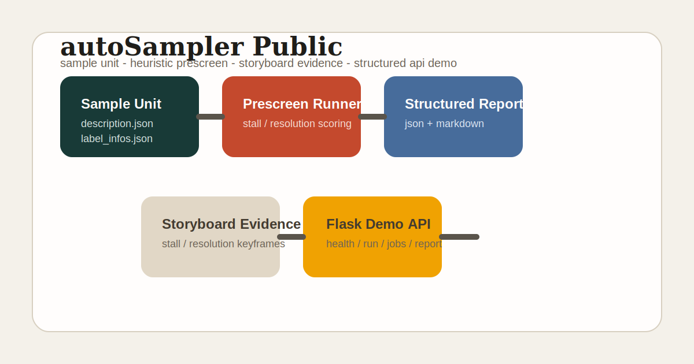
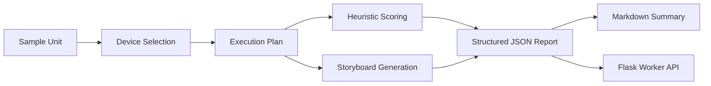

# autoSampler Public

[](https://github.com/Nightaw/autoSampler-public/actions/workflows/ci.yml)



Public-facing demonstration repository for an audio/video sampling and label-prescreen pipeline.  
The repository focuses on a complete post-capture flow: sample-unit ingestion, heuristic review, storyboard evidence generation, structured reporting, and a lightweight worker-style API surface.

Primary entry points:

- [Showcase Page](./docs/index.html)
- [README](./README.md)
- [Architecture](./docs/architecture.md)

## Highlights

- Mock service layer with queue-style job lifecycle
- Device registry and scenario execution planning
- Stall / resolution heuristic scoring
- Storyboard generation from sample recordings
- JSON and Markdown report artifacts
- Unit tests and GitHub Actions CI

## Pipeline



## Repository Layout

```text
autoSampler-public/
├── app/                       # Flask API endpoints
├── common/                    # devices, scenario runner, prescreen logic
├── docs/                      # architecture and showcase material
├── samples/
│   ├── payloads/              # API request examples
│   ├── results/               # generated reports and storyboard images
│   └── units/                 # public sample units
├── tests/                     # runner and API tests
└── tools/                     # local entry points
```

## Demo Surface

### REST Endpoints

- `GET /health`
- `GET /demo/devices`
- `GET /demo/scenarios`
- `GET /demo/scenarios/<scenario_name>`
- `GET /demo/architecture`
- `GET /demo/showcase`
- `POST /demo/run`
- `POST /demo/jobs`
- `POST /demo/jobs/process`
- `GET /demo/jobs/<job_id>`
- `GET /demo/report.md?scenario=<scenario_name>`

### Built-in Scenarios

- `baseline_prescreen`
  Stable end-to-end prescreen example using a clean sample unit.
- `resolution_consistency_review`
  Scenario tuned to surface bandwidth-versus-resolution inconsistencies.

## Quick Start

```bash
python3 -m venv .venv
source .venv/bin/activate
pip install -r requirements.txt
```

### Run a Scenario

```bash
python3 tools/run_mock_job.py --scenario baseline_prescreen
python3 tools/run_mock_job.py --scenario resolution_consistency_review
```

### Start the API

```bash
python3 tools/run_worker_server.py
curl -X POST http://127.0.0.1:7777/demo/run \
  -H "Content-Type: application/json" \
  -d @samples/payloads/baseline_prescreen.json
```

### Run Tests

```bash
python3 -m unittest discover -s tests -v
```

### Export Portfolio Manifest

```bash
python3 tools/export_showcase_bundle.py
```

### Build Showcase Page

```bash
python3 tools/build_showcase_page.py
```

## Sample Artifacts

- [baseline_prescreen.json](./samples/results/baseline_prescreen.json)
- [baseline_prescreen.md](./samples/results/baseline_prescreen.md)
- [resolution_consistency_review.json](./samples/results/resolution_consistency_review.json)
- [resolution_consistency_review.md](./samples/results/resolution_consistency_review.md)
- [stall_storyboard.jpg](./samples/results/stall_storyboard.jpg)
- [resolution_storyboard.jpg](./samples/results/resolution_storyboard.jpg)
- [resolution_review_storyboard.jpg](./samples/results/resolution_review_storyboard.jpg)

## Documentation

- [Architecture](./docs/architecture.md)
- [Design Decisions](./docs/design-decisions.md)
- [API Reference](./docs/worker-api.md)
- [Showcase Notes](./docs/showcase.md)
- [Showcase Page](./docs/index.html)
- [Bilingual Summary](./docs/summary-cn-en.md)
- [Public Scope](./docs/public-scope.md)

## Scope

This repository is a curated public demo rather than a raw production export.  
The retained parts are the ones that best communicate engineering structure: sample modeling, scenario planning, heuristic review, evidence generation, reporting, and service integration. Internal infrastructure, credentials, and business-specific assets are intentionally excluded.
